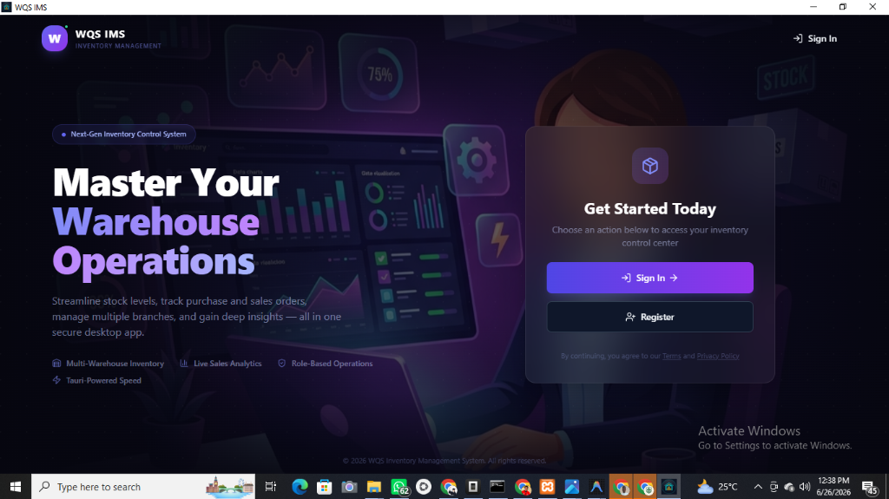
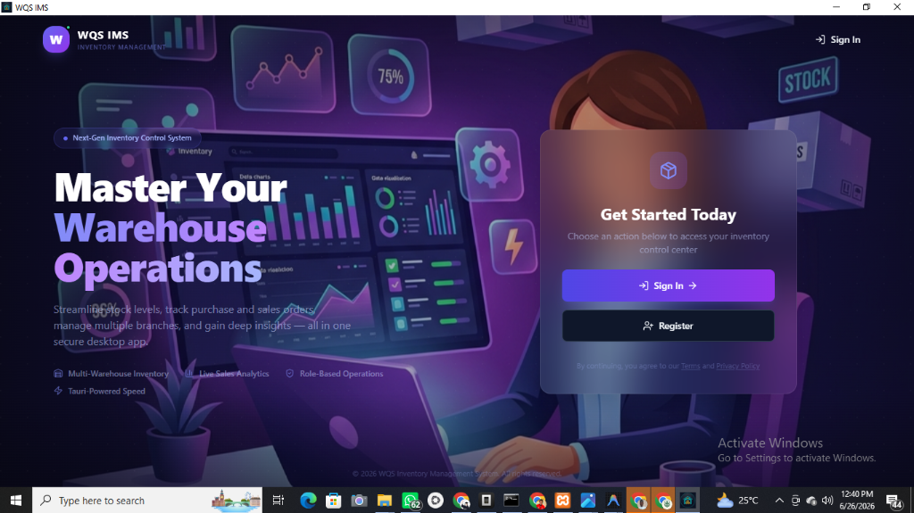
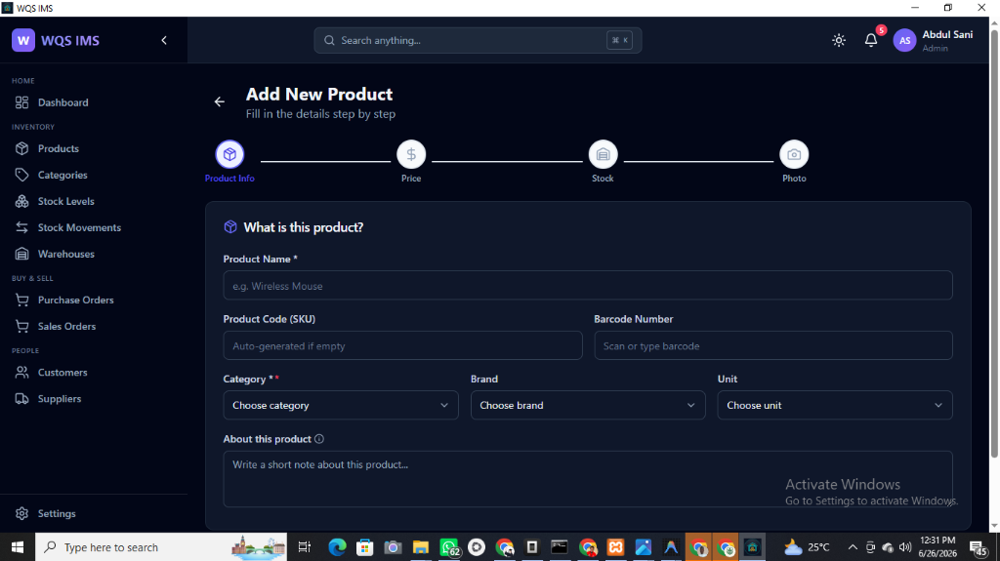
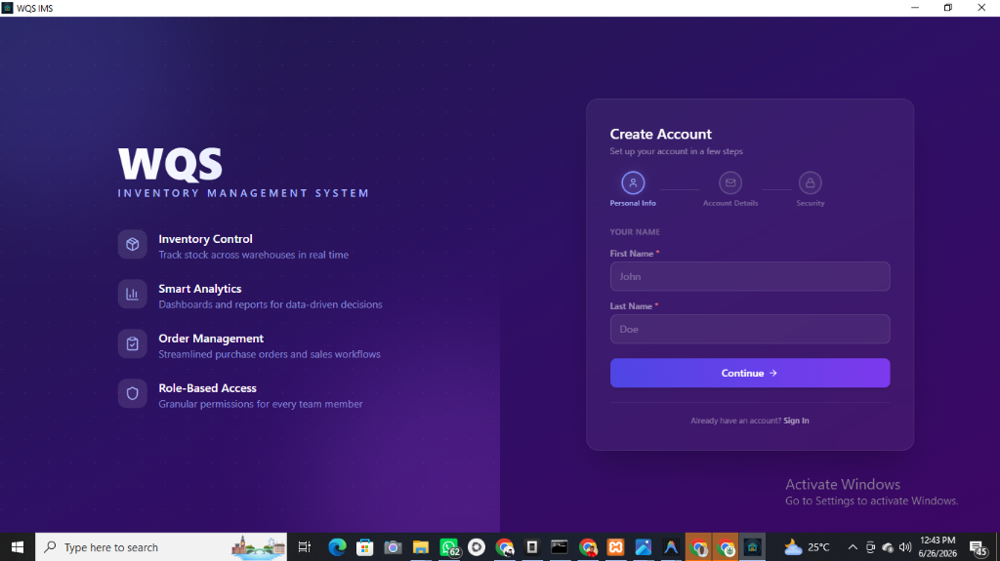
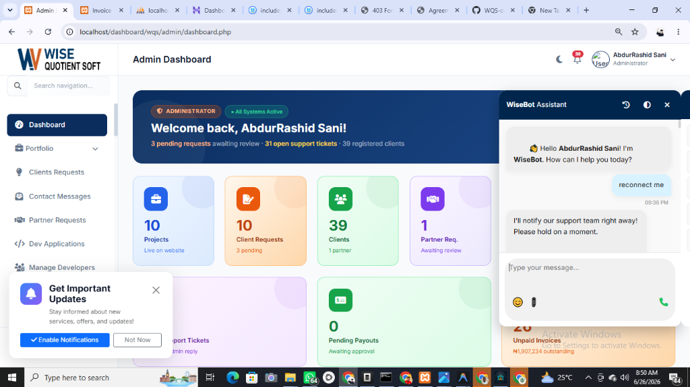
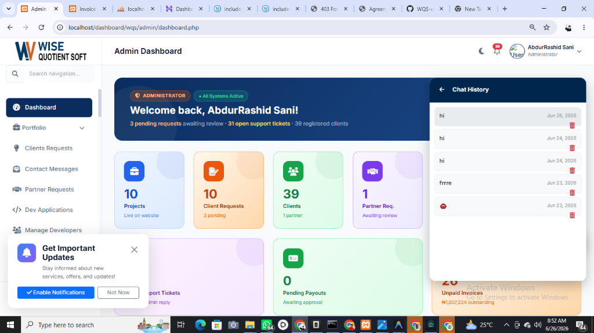
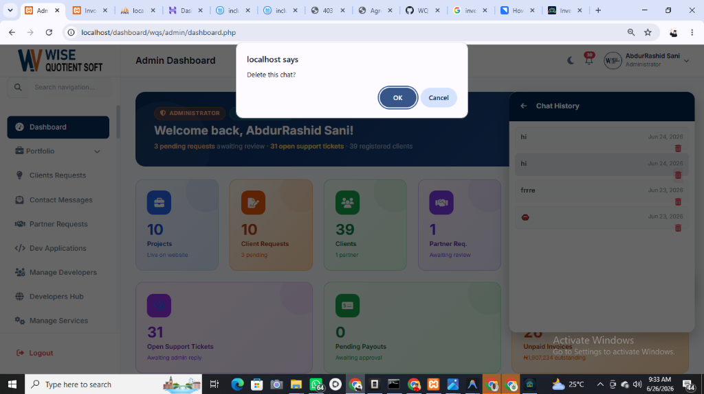

# 📦 WQS IMS — Enterprise Inventory Management System

Welcome to the official repository of **WQS IMS** (Wise Quotient Soft - Inventory Management System), a premium, state-of-the-art desktop application built with **React**, **TypeScript**, **Tailwind CSS**, and **Tauri (v2)**, powered by a robust **MySQL** database backend.

---

## ✨ Features

- **🌐 Multi-Warehouse Inventory**: Monitor, track, and manage stock levels in real time across multiple warehouse locations.
- **📈 Smart Sales Analytics**: Visualize key metrics, purchase and sales order progress, profit summaries, margins, and trends.
- **🔑 Role-Based Access Control (RBAC)**: Secure access controls for Admins and Staff with custom permissions.
- **🎨 Dynamic Company Branding**: Upload and store your company logo, registration numbers, tax details, and authorized signature.
- **👤 Personalized Profile Settings**: Edit profile details and upload a custom avatar that dynamically syncs with the Topbar header.
- **₦ Regional Currency Options**: Full support for regional currency settings including the **Nigerian Naira (₦)** with automated formatting on prices and summary statistics.
- **🚀 Tauri & Rust Native Performance**: Lightning-fast native desktop experience utilizing Rust for low-level database operations and window management.

---

## 📸 Project Screenshots

Here is a gallery of the system interfaces showing our premium user experiences:

<div align="center">
  <h3>🏠 Application Dashboard</h3>
  
  <p><i>Live sales analytics, warehouse inventory levels, and activity streams.</i></p>
  
  <br/>
  
  <h3>📦 Products & Inventory List</h3>
  
  <p><i>Dynamic search, filters, inline actions, and tabular/grid view toggles.</i></p>

  <br/>
  
  <h3>📝 Add/Edit Product Form</h3>
  
  <p><i>Multi-step wizard with Naira/local currency inputs, profit calculations, and photo uploads.</i></p>

  <br/>

  <h3>⚙️ Company & Brand Settings</h3>
  
  <p><i>Logo upload, Tax/RC parameters, email, website, and signature block updates.</i></p>

  <br/>

  <h3>🔐 Professional Authentication Screens</h3>
  <table width="100%">
    <tr>
      <td width="50%" align="center">
        
        <br/><i>Get Started landing screen</i>
      </td>
      <td width="50%" align="center">
        
        <br/><i>Secure Login Panel</i>
      </td>
    </tr>
  </table>
  <br/>
  
  <p><i>Account registration with full-screen illustration backdrops and step validation.</i></p>
</div>

---

## 🛠️ Tech Stack

* **Frontend**: React (Zustand State Management, Framer Motion animations)
* **Styling**: Tailwind CSS & Lucide Icons
* **Build System**: Vite & TypeScript
* **Desktop Wrapper**: Tauri v2 (Rust backend framework)
* **Database**: MySQL (using `sqlx` with connection pooling)

---

## 🚀 Setup & Installation

### Prerequisites

Ensure you have the following installed on your developer machine:
1. **Node.js** (v18 or newer)
2. **Rust & Cargo** (for Tauri compilation)
3. **XAMPP / MySQL Server** (running locally on port `3306`)

### Setup Database

1. Start your local MySQL server (e.g. from XAMPP Control Panel).
2. The Tauri Rust backend automatically creates the `wqs_ims` database, applies all schema migrations (up to `migration #37`), and seeds the initial Admin roles/user accounts on first launch.
3. If you want to review the raw SQL schema, check out [database/schema.sql](database/schema.sql).

### Install Dependencies

```bash
# Clone the repository
git clone https://github.com/WQS-company/WQS-IMS.git
cd WQS-IMS

# Install npm packages
npm install
```

### Running in Development

```bash
npm run tauri dev
```

### Building Production Bundle

```bash
npm run tauri build
```

---

## 🔒 License

Built by **Wise Quotient Soft** (WQS). All rights reserved.
